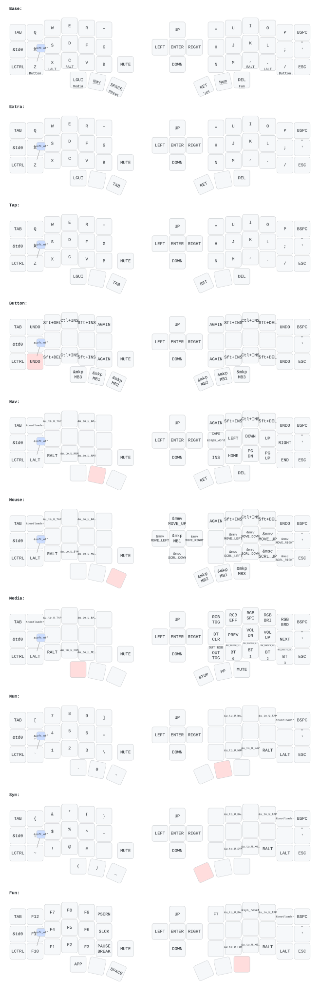

# eyelash_corne zmk-config

[](LICENSE)
[](https://github.com/manna-harbour/miryoku)
[](https://zmk.dev)
[](https://woodpecker.kudofools.dev)
[](https://pypi.org/project/keymap-drawer/)

ZMK firmware configuration for the **eyelash_corne** split keyboard, built on the [Miryoku](https://github.com/manna-harbour/miryoku) layout with a [customized 48-key mapping](config/miryoku/mapping/48/eyelash_corne.h). Auto-built and released by [Woodpecker CI](.woodpecker/).

## Keyboard

| | |
|---|---|
| **MCU** | 2x nice!nano v2 (BLE) |
| **Layout** | Miryoku 3x5+2 split, 48 keys |
| **Encoder** | 1x EC11 rotary (left side) |
| **Display** | nice!view-compatible OLED (nice_oled module) |
| **Extras** | RGB underglow, NKRO, ZMK Studio (left half) |

## Layers

Miryoku's standard set, plus a custom `Extra` layer:

| Layer | Contents |
|---|---|
| **Base** | QWERTY alphas, thumb cluster |
| **Tap** | Symbols / shifted variants |
| **Button** | Mouse buttons & media shortcuts |
| **Nav** | Arrows, Home/End, PgUp/PgDn, browser keys |
| **Mouse** | Pointer movement & scroll |
| **Media** | Media control |
| **Num** | Numbers & F-row |
| **Sym** | Symbols |
| **Fun** | Function keys |
| **Extra** | Clipboard ops, undo, macro bindings |

Visual reference (auto-rendered by CI on every keymap change):



## Structure

```
zmk-config/
├── config/
│   ├── eyelash_corne.keymap   # Keymap entrypoint (behaviors, combos, includes)
│   ├── eyelash_corne.conf     # Kconfig: OLED, RGB, encoder, pointing, sleep
│   ├── west.yml               # ZMK fork + module manifest
│   └── miryoku/               # Miryoku library (custom_config.h, mapping, dtsi)
├── boards/shields/eyelash_corne/  # Shield: matrix, encoder, RGB, OLED
├── keymap-drawer/             # Auto-rendered SVG + YAML (CI generated)
├── .woodpecker/               # CI: build → OCI upload → release → keymap-drawer
└── .pre-commit-config.yaml    # commitlint, file checks, gitleaks
```

## Build

Requires `west` and a ZMK build environment. The CI does this automatically, but locally:

```sh
west init -l config
west update --fetch-opt=--filter=tree:0
west build -s zmk/app -d build/right -b nice_nano_v2 -- \
  -DZMK_EXTRA_MODULES="$PWD/boards" -DZMK_CONFIG="$PWD/config" \
  -DSHIELD="eyelash_corne_right nice_oled"
```

Artifacts land in `build/*/zephyr/zmk.uf2`.

## Flashing

1. Download the latest firmware from the [GitHub mirror releases](https://github.com/izayoilv/zmk-config/releases) (a mirror is pushed to GitHub; the CI pipeline status is visible in the [Actions](https://github.com/izayoilv/zmk-config/actions) tab).
2. Double-tap **RESET** on the nice!nano to enter bootloader.
3. Copy the matching `.uf2`:
   - `eyelash_corne_right-nice_nano_v2-zmk.uf2` → right half
   - `eyelash_corne_studio_left-nice_nano_v2-zmk.uf2` → left half
   - `settings_reset-nice_nano_v2-zmk.uf2` → reset to defaults

## CI pipeline

Every push to `config/` or `boards/` runs through [Woodpecker](.woodpecker/build.yaml):

1. **build** — compiles right / left / reset firmware (shared west cache on the node)
2. **oci_upload** — pushes `zmk-firmware:sha-<commit>` to the private OCI registry
3. **release** (on tag) — publishes a Forgejo release with the UF2s
4. **keymap-drawer** — parses the keymap, renders `keymap-drawer/eyelash_corne.svg`, commits it back

## Customization

- **Layout**: edit `config/miryoku/mapping/48/eyelash_corne.h`
- **Behaviors/combos**: edit `config/eyelash_corne.keymap`
- **Features**: toggle in `config/eyelash_corne.conf`
- **Miryoku itself**: `config/miryoku/` is the upstream library — override via `custom_config.h`

## License

[MIT](LICENSE) © 2026 IzayoiLv
